# Seriph Durable Batch Import Pipeline Implementation Plan

> **For agentic workers:** REQUIRED SUB-SKILL: Use superpowers:subagent-driven-development (recommended) or superpowers:executing-plans to implement this plan task-by-task. Steps use checkbox (`- [ ]`) syntax for tracking.

**Goal:** Replace Seriph's file-first upload path with a durable, automatic batch workflow that inventories every dropped source, plans canonical families before mutation, publishes clean families transactionally, enriches each family independently, and reports live batch/family/file status through terminal outcomes.

**Architecture:** Firestore becomes the workflow authority through owner-scoped import batches, immutable plan versions, transactional asset claims, and per-family enrichment jobs. Cloud Tasks drives idempotent stage workers; Cloud Functions handle normal work, while one Cloud Run service streams oversized ZIPs using the same archive policy. The Next.js API supplies authenticated commands and recovery reads, while Firestore listeners provide the normal real-time UI path.

**Tech Stack:** Next.js 16.2, React 19.2, TypeScript 6, Firebase Auth, Firestore, Cloud Storage, Cloud Functions gen2 on Node 22, Cloud Tasks, Cloud Run, Vertex AI Batch API, Remote Config, `fontkit`, `opentype.js`, `unzipper`, `wawoff2`, Vitest, Firebase emulators.

## Global Constraints

- Follow `docs/superpowers/specs/2026-07-17-seriph-durable-import-pipeline-design.md` as the architectural source of truth.
- A clean batch imports automatically after its immutable plan validates; only ambiguous or unsafe items enter review.
- Deterministic catalogue application must make a family visible and usable before AI completes.
- Every source and extracted item retains original path/archive lineage, SHA-256, content-detected format, parsed metadata, planned action, reason code, and terminal outcome.
- Resolve identity from font contents before filenames and paths; detect Variable from non-empty axes rather than file extension.
- Deduplicate only identical SHA-256 bytes. Preserve meaningful versions and different formats as assets of one logical face.
- Keep source/design, documentation, web, and extra files private; publish only approved font payloads.
- Validate canonical destinations case-insensitively and keep public asset paths content-addressed.
- All workers, triggers, routes, scripts, and retries must be idempotent and owner-scoped.
- All source files remain at or below 100 non-empty lines; split by domain responsibility instead of compressing code.
- Do not hardcode model IDs, archive limits, queue rollout flags, or retry policy values that belong in Remote Config.
- Preserve existing catalogue IDs and compatibility fields until additive migration and canary verification complete.
- Do not overwrite or stage unrelated dirty-worktree changes in `firestore.rules`, `functions/package.json`, `functions/src/index.ts`, auth modules, or their tests; reconcile overlaps deliberately during execution.
- Use TDD, focused verification after every task, a complete gate after every phase, and small commits with only the named files.

---

## Architecture delta by layer

| Layer | Current contract | Target contract | Concrete change |
| --- | --- | --- | --- |
| Workflow authority | Per-file `users/{uid}/ingests` plus best-effort batch counters | `users/{uid}/importBatches/{batchId}` and immutable child records | Add explicit batch/source/item/family-plan/task/mutation records; retain legacy ingests as read-only history during migration |
| Eventing | Storage finalization directly discovers and mutates | Storage finalization only confirms bytes and enqueues durable work | Add Cloud Tasks outbox, deterministic task keys, leases, and a thin task handler |
| Archives | Inline recursive ZIP expansion; oversized ZIPs skipped | Bounded inventory-first expansion; oversized ZIPs stream in Cloud Run | Share archive policy, quarantine unsafe entries, stage extracted objects privately, reconcile fan-out counters |
| Classification | Extension-first routing, filename context early | Content signatures and font metadata first | Add role/content detector, canonical identity planner, technology detector, and structured reason codes |
| Deduplication | Query historical ingests by hash | Transactional per-owner SHA-256 claims | Add leased/committed asset claims; failed attempts never count as committed duplicates |
| Catalogue persistence | One face written at a time; same face can be overwritten | One clean family plan applied atomically; logical faces own multiple assets | Add `assets[]`, preferred-asset projection, family preconditions, mutation audit, rollback guard |
| Enrichment | Global ready-family batch with weak poison/missing-row isolation | Versioned per-family jobs grouped into provider batches | Add preflight, expected-set reconciliation, bounded retries, leases, atomic enrichment/search swap |
| API/middleware | Upload registration and active-ingest polling | Batch commands plus owner-scoped recovery/list/detail APIs | Add import routes, validators, idempotency middleware, and OpenAPI contracts |
| Frontend state | Active-only 8-second polling and file rows | Real-time batch/family/item listeners plus API fallback | Replace upload context view model; keep client byte progress as a temporary overlay |
| Upload Center | Flat file list with disappearing terminal rows | Batch-first recent history with drill-down and actions | Add phase summaries, family expansion, review/failure details, retry/cancel actions, 30-day recent history |
| Operations | Function deploy and scattered manual repair | Scripted queue/service/lifecycle setup, reconciliation, canary, staged cutover | Add `infra/import-pipeline/`, dry-run scripts, structured metrics, dashboards, and rollback gates |

## Runtime topology

```mermaid
flowchart LR
  UI["Import Workspace"] --> API["Next.js batch command API"]
  API --> FS["Firestore import batch manifest"]
  UI --> INTAKE["Private Storage intake"]
  INTAKE --> FINALIZE["Storage finalize trigger"]
  FINALIZE --> OUTBOX["Firestore task lease/outbox"]
  OUTBOX --> QUEUE["Cloud Tasks seriph-import"]
  QUEUE --> WORKER["Import task Cloud Function"]
  QUEUE --> RUN["Cloud Run archive worker"]
  WORKER --> INVENTORY["Sources and inventory items"]
  RUN --> INVENTORY
  INVENTORY --> PLAN["Immutable family plan version"]
  PLAN --> APPLY["Transactional family application"]
  APPLY --> CDN["Content-addressed public font assets"]
  APPLY --> CATALOG["Canonical Firestore family"]
  APPLY --> EJ["Per-family enrichment job"]
  EJ --> VERTEX["Vertex provider batch"]
  VERTEX --> RECON["Expected-set output reconciler"]
  RECON --> CATALOG
  FS --> LISTEN["Owner-scoped Firestore listeners"]
  LISTEN --> CENTER["Upload Center"]
  API -. "fallback reads" .-> CENTER
```



## Authoritative Firestore model

| Path | Purpose | Primary key/idempotency rule |
| --- | --- | --- |
| `users/{uid}/importBatches/{batchId}` | Batch phases, counters, outcome, progress, seal, plan version | `batchId` allocated by create API; repeated `clientRequestId` returns the same batch |
| `.../sources/{sourceId}` | Every browser-selected source and upload terminality | Stable client-generated UUID reused for registration and retry |
| `.../items/{itemId}` | Every source/archive entry and durable inventory | SHA-256 of batch/source/archive-lineage/normalized path, not content hash |
| `.../families/{familyPlanId}` | Immutable family application unit | SHA-256 of owner/canonical family key/plan version |
| `.../tasks/{taskKey}` | Lease, attempt, terminal result for stage work | Stable stage plus resource IDs plus plan version |
| `.../mutations/{mutationId}` | Applied family delta and rollback preconditions | Family-plan application key |
| `users/{uid}/assetClaims/{sha256}` | Byte-identical asset lease/commit | Full SHA-256 document ID |
| `enrichmentJobs/{jobId}` | Per-family/version enrichment state | Hash of family/version/prompt/model/embedding versions |
| `batchJobs/{providerRunId}` | Vertex provider batch and complete expected job set | Provider run ID; each expected job appears once |
| `fontfamilies/{ownerId}__{slug}` | Canonical visible family and compatibility projection | Existing owner-scoped catalogue ID retained |

Batch documents hold summaries only. Items and family plans hold details, keeping listener payloads bounded. Server transactions own counters; clients never write phase, outcome, plan, claim, family, mutation, or enrichment state.

## State and outcome contract

```text
source:     registered -> uploading -> uploaded -> discovering -> discovered
item:       discovered -> classified -> planned -> applied
plan:       building -> validated -> applying -> applied
enrichment: blocked -> queued -> rendering -> submitted -> analyzing
            -> embedding -> indexing -> complete
```

Terminal alternatives are explicit: source `failed|canceled|timed_out`; item `duplicate|review|discarded|failed`; plan `partial|failed`; enrichment `failed|skipped_disabled`. Batch outcome precedence is `canceled`, `needs_review`, `partial`, `failed`, `succeeded`, while any nonterminal child keeps the batch `active`.

## API and middleware contract

| Method/path | Responsibility | Validation/idempotency |
| --- | --- | --- |
| `POST /api/v1/import-batches` | Create or recover a batch | Firebase ID token; `Idempotency-Key`; label and expected count bounds |
| `GET /api/v1/import-batches` | Recent history/polling fallback | Owner scope; cursor; limit 1-50; optional outcome filter |
| `GET /api/v1/import-batches/{batchId}` | Batch summary plus bounded expanded view | Owner path; child limits and cursors |
| `POST /api/v1/import-batches/{batchId}/sources` | Register source chunks | Stable `sourceId`; size/path/type validation; max 200/request |
| `POST /api/v1/import-batches/{batchId}/seal` | Freeze expected source set | Registered count must equal `expectedSourceCount` |
| `POST /api/v1/import-batches/{batchId}/sources/{sourceId}/failure` | Persist client upload failure/cancel | Source transition precondition; idempotent terminal result |
| `POST /api/v1/import-batches/{batchId}/actions/retry` | Retry one failed stage/family/source | Allowlisted target/stage; attempt and lease checks |
| `POST /api/v1/import-batches/{batchId}/actions/cancel` | Cancel uncommitted work | Already-applied families remain immutable history |

Routes use `getUidFromRequest()`, `readJsonObject()`, shared import validators, and store functions. Route files do not contain Firestore transaction logic. `Idempotency-Key` is required for create and mutation commands and maps to a server-owned command receipt; retries return the stored response.

The request pipeline is deliberately ordered:

```text
Firebase bearer verification
  -> route/path parameter normalization
  -> bounded JSON/query parsing
  -> import DTO validation
  -> owner-path lookup
  -> idempotency receipt lookup/reservation
  -> domain command transaction
  -> stable API envelope and typed status code
```

Authentication failures return 401 before document lookup. Cross-owner resources return 404 so IDs are not disclosed. Validation returns 400/413, state or idempotency conflicts return 409, queue pressure returns 429 with `Retry-After`, and unexpected failures return a correlation ID with 500 while logging the original exception server-side. No global Next.js middleware reads Firestore; these small route helpers keep Node runtime/auth behavior explicit and testable.

## Planned file structure

```text
functions/src/imports/
  contracts/       batch, source, item, plan, task, mutation types
  state/           transition guards and derived outcome/counters
  store/           Firestore paths and transaction repositories
  tasks/           Cloud Tasks payload, enqueue, lease, dispatch
  discovery/       content signatures, roles, inventory, archive policy
  planning/        canonical identity, technology, logical faces, plan validation
  apply/           claims, artifacts, family transaction, mutation, rollback
  reconcile/       source, plan, batch, timeout, orphan audits
functions/src/enrichment/
  jobs/            per-family job state, collector, retry/watchdog
  provider/        Vertex input, expected set, output reconciliation
functions/src/triggers/
  imports.ts       thin Storage/task/schedule entrypoints
functions/src/scripts/
  reconcileImportPipeline.ts
functions/tests/imports/ and functions/tests/enrichment/

app/api/v1/import-batches/       thin authenticated route handlers
lib/server/imports/              request validation, command receipts, queries
models/import-batch.models.ts    browser-safe DTO/view model types
lib/imports/                     API client, Firestore mapping, phase summaries
lib/hooks/                       upload controller and lazy child listeners
lib/contexts/UploadContext.tsx   batch state and client-progress overlay
components/upload/               modal, summary, batch/family/item/review rows
infra/import-pipeline/           setup, lifecycle, queue and archive deployment
```

## Dependency graph and parallel work

```text
Recovery 1 -> Recovery 2 -> Checkpoint R

Contracts 3 -> Stores 4 -> Rules 5
                    |-> Queue core 6 -> Import config 6A -> Worker 7
                    |-> Batch APIs 8 -> Command APIs 9 -> Browser upload 10

Worker 7 -> Source finalization 11 -> Inventory 12 -> ZIP 13 -> Cloud Run + infra 14
Inventory 12 -> Identity 15 -> Claims + plan 16

Plan 16 -> Asset model 17 -> Family apply 18 -> Reconcile/rollback 19

Family apply 18 -> Enrichment jobs 20 -> Provider submit 21
Provider submit 21 -> Output/retry 22

Batch APIs 8 + Rules 5 -> Listener/context 23 -> Batch UI 24 -> Detail/actions 25
Browser upload 10 + Listener/context 23 -> Import handoff 26

All above -> Compatibility migration 27 -> E2E/rollout 28
```

After Tasks 5 and 8 establish contracts, discovery Tasks 11-15 and frontend Tasks 23-24 may proceed in parallel. Catalogue application must wait for plan/claim contracts. Enrichment must wait for family versioning. Production mutation waits for every earlier checkpoint and explicit canary approval.

## Phase 0: Repair the current production lane

### Task 1: Isolate poison families during enrichment submission

**Files:**
- Create: `functions/src/enrichment/preflight.ts`
- Modify: `functions/src/ingest/batch/submit.ts`
- Test: `functions/tests/enrichment/preflight.test.ts`
- Test: `functions/tests/enrichment/submitIsolation.test.ts`

**Interfaces:**
- Consumes: existing `FontFamilyDoc`, `renderFamilySpecimen()`, and ready-family query.
- Produces: `preflightFamily(family): FamilyPreflightResult` and submission counts `{ selected, submitted, rejected }`.

- [ ] **Step 1: Write failing preflight and poison-isolation tests.**

```ts
it("rejects a family without owner or faces without throwing", () => {
  expect(preflightFamily({ id: "chap", status: "ready", faces: [] } as FontFamilyDoc)).toEqual({
    kind: "rejected",
    code: "invalid_family",
    reasons: ["missing_owner", "missing_faces"],
  });
});

it("submits valid families when one selected family is malformed", async () => {
  const result = await buildSubmissionCandidates([malformedFamily, validFamily], renderFixture);
  expect(result.accepted.map((entry) => entry.family.id)).toEqual([validFamily.id]);
  expect(result.rejected).toHaveLength(1);
});
```

- [ ] **Step 2: Run the focused tests and verify RED.**

Run: `npm test --prefix functions -- tests/enrichment/preflight.test.ts tests/enrichment/submitIsolation.test.ts`

Expected: FAIL because submission renders every selected family before validation and one exception aborts the run.

- [ ] **Step 3: Add the explicit preflight result and isolate rendering.**

```ts
export type FamilyPreflightResult =
  | { kind: "accepted" }
  | { kind: "rejected"; code: "invalid_family" | "alias"; reasons: string[] };

export function preflightFamily(family: FontFamilyDoc): FamilyPreflightResult {
  const reasons = [
    !family.ownerId ? "missing_owner" : null,
    !Array.isArray(family.faces) || family.faces.length === 0 ? "missing_faces" : null,
  ].filter((value): value is string => value !== null);
  if (family.hidden || family.mergedInto || family.aliasOf) {
    return { kind: "rejected", code: "alias", reasons: ["non_canonical"] };
  }
  return reasons.length ? { kind: "rejected", code: "invalid_family", reasons } : { kind: "accepted" };
}
```

Catch specimen failures per family, persist the original message/stack and rejection code, and continue building valid JSONL rows. The scheduler must log selected/submitted/rejected counts and never replace the originating exception with a logger failure.

- [ ] **Step 4: Run focused GREEN tests and the Functions build.**

Run: `npm test --prefix functions -- tests/enrichment/preflight.test.ts tests/enrichment/submitIsolation.test.ts && npm run build --prefix functions`

Expected: PASS; a malformed family yields one rejected record and valid candidates remain submit-ready.

- [ ] **Step 5: Commit.**

```bash
git add functions/src/enrichment/preflight.ts functions/src/ingest/batch/submit.ts functions/tests/enrichment/preflight.test.ts functions/tests/enrichment/submitIsolation.test.ts
git commit -m "fix: isolate enrichment submission failures"
```

### Task 2: Build the dry-run production reconciler

**Files:**
- Create: `functions/src/scripts/pipelineRecoveryPlan.ts`
- Create: `functions/src/scripts/reconcileImportPipeline.ts`
- Create: `functions/tests/scripts/pipelineRecoveryPlan.test.ts`
- Modify: `functions/package.json`

**Interfaces:**
- Consumes: current family/ingest snapshots and the Task 1 rejection codes.
- Produces: pure `planPipelineRecovery(snapshot): RecoveryAction[]` plus CLI `--dryRun`, `--apply`, `--ownerId`, and `--json` modes.

- [ ] **Step 1: Write the recovery planner test.**

```ts
it("quarantines malformed canonicals, restores aliases, and resolves stale ingests", () => {
  expect(planPipelineRecovery(fixture)).toEqual([
    { kind: "quarantine_family", familyId: "chap", reason: "missing_owner_and_faces" },
    { kind: "restore_alias", familyId: "old-alias", targetId: "canonical" },
    { kind: "resolve_ingest", ownerId: "u1", ingestId: "i1", state: "complete" },
  ]);
});
```

- [ ] **Step 2: Run RED.**

Run: `npm test --prefix functions -- tests/scripts/pipelineRecoveryPlan.test.ts`

Expected: FAIL because the planner and CLI do not exist.

- [ ] **Step 3: Implement pure planning and guarded application.**

```ts
export type RecoveryAction =
  | { kind: "quarantine_family"; familyId: string; reason: string }
  | { kind: "restore_alias"; familyId: string; targetId: string }
  | { kind: "resolve_ingest"; ownerId: string; ingestId: string; state: "complete" | "failed" }
  | { kind: "requeue_family"; familyId: string; version: number };
```

The CLI defaults to dry run, refuses writes without `--apply`, emits before/action/after counts, uses transactions with snapshot preconditions, and writes an audit document for every action. Add script `reconcile:import-pipeline` that builds before running the compiled CLI.

- [ ] **Step 4: Verify tests, build, and dry-run command shape.**

Run: `npm test --prefix functions -- tests/scripts/pipelineRecoveryPlan.test.ts && npm run build --prefix functions && npm run reconcile:import-pipeline --prefix functions -- --dryRun --json`

Expected: tests/build PASS; CLI prints JSON with `mode: "dryRun"` and performs zero writes.

- [ ] **Step 5: Commit without applying production mutations.**

```bash
git add functions/src/scripts/pipelineRecoveryPlan.ts functions/src/scripts/reconcileImportPipeline.ts functions/tests/scripts/pipelineRecoveryPlan.test.ts functions/package.json
git commit -m "chore: add import pipeline recovery reconciler"
```

### Checkpoint R: Recovery tooling

- [ ] Run all Functions tests and build.
- [ ] Review the dry-run JSON counts and sampled document IDs.
- [ ] Do not run `--apply` until the new submission isolation is deployed and the user approves the dry-run report.

## Phase 1: Durable contracts, persistence, and task infrastructure

### Task 3: Define import domain records and state reduction

**Files:**
- Create: `functions/src/imports/contracts/batch.ts`
- Create: `functions/src/imports/contracts/item.ts`
- Create: `functions/src/imports/state/deriveBatchOutcome.ts`
- Test: `functions/tests/imports/deriveBatchOutcome.test.ts`

**Interfaces:**
- Consumes: approved source/item/plan/enrichment states from the specification.
- Produces: persistence types and `deriveBatchOutcome(input): ImportBatchOutcome`.

- [ ] **Step 1: Write table-driven outcome tests.**

```ts
it.each([
  [{ nonterminal: 1 }, "active"],
  [{ canceled: 1, appliedFamilies: 1 }, "canceled"],
  [{ review: 1, appliedFamilies: 1 }, "needs_review"],
  [{ failures: 1, appliedFamilies: 1 }, "partial"],
  [{ failures: 1, appliedFamilies: 0 }, "failed"],
  [{ duplicates: 3 }, "succeeded"],
])("derives %s as %s", (input, expected) => {
  expect(deriveBatchOutcome(fullSummary(input))).toBe(expected);
});
```

- [ ] **Step 2: Run RED.**

Run: `npm test --prefix functions -- tests/imports/deriveBatchOutcome.test.ts`

Expected: FAIL because the contracts and reducer do not exist.

- [ ] **Step 3: Add closed unions and a pure precedence reducer.**

```ts
export type ImportBatchOutcome =
  | "active" | "succeeded" | "partial" | "needs_review" | "failed" | "canceled";

export function deriveBatchOutcome(summary: BatchTerminalSummary): ImportBatchOutcome {
  if (summary.nonterminal > 0) return "active";
  if (summary.canceled > 0) return "canceled";
  if (summary.review > 0) return "needs_review";
  if (summary.failures > 0 && summary.appliedFamilies > 0) return "partial";
  if (summary.failures > 0 && summary.appliedFamilies === 0) return "failed";
  return "succeeded";
}
```

Define explicit phase records, structured `ImportError`, archive lineage, role/action/reason enums, and counters. Do not include Firebase classes in pure input types.

- [ ] **Step 4: Run GREEN and line-count lint.**

Run: `npm test --prefix functions -- tests/imports/deriveBatchOutcome.test.ts && npm run lint:lines`

Expected: PASS; every new source file is below the 100-line gate.

- [ ] **Step 5: Commit.**

```bash
git add functions/src/imports/contracts/batch.ts functions/src/imports/contracts/item.ts functions/src/imports/state/deriveBatchOutcome.ts functions/tests/imports/deriveBatchOutcome.test.ts
git commit -m "feat: define durable import states"
```

### Task 4: Add owner-scoped import repositories and transactions

**Files:**
- Create: `functions/src/imports/store/paths.ts`
- Create: `functions/src/imports/store/batchStore.ts`
- Create: `functions/src/imports/store/sourceStore.ts`
- Test: `functions/tests/imports/importStores.test.ts`

**Interfaces:**
- Consumes: Task 3 persistence records.
- Produces: typed path helpers, `createBatch()`, `registerSource()`, `transitionSource()`, and `updateBatchSummary()`.

- [ ] **Step 1: Write repository contract tests against fakes.**

```ts
it("registers one stable source and does not double-increment on retry", async () => {
  await registerSource(store, input);
  await registerSource(store, input);
  expect(store.sourceWrites).toHaveLength(1);
  expect(store.batch.registeredSourceCount).toBe(1);
});

it("rejects an invalid source transition", async () => {
  await expect(transitionSource(store, ref, "discovered", "uploading"))
    .resolves.toEqual({ kind: "invalid_transition", from: "discovered", to: "uploading" });
});
```

- [ ] **Step 2: Run RED.**

Run: `npm test --prefix functions -- tests/imports/importStores.test.ts`

Expected: FAIL because repositories do not exist.

- [ ] **Step 3: Implement path ownership and transaction preconditions.**

```ts
export const importBatchRef = (db: Firestore, uid: string, batchId: string) =>
  db.collection("users").doc(uid).collection("importBatches").doc(batchId);

export const importSourceRef = (db: Firestore, uid: string, batchId: string, sourceId: string) =>
  importBatchRef(db, uid, batchId).collection("sources").doc(sourceId);
```

Create and transition operations must validate owner path, expected prior state, stable source identity, server timestamps, and counter deltas in one Firestore transaction. Expected workflow conflicts return discriminated results rather than generic exceptions.

- [ ] **Step 4: Run GREEN and Functions build.**

Run: `npm test --prefix functions -- tests/imports/importStores.test.ts && npm run build --prefix functions`

Expected: PASS; repeated source registration is a no-op and illegal transitions are rejected.

- [ ] **Step 5: Commit.**

```bash
git add functions/src/imports/store/paths.ts functions/src/imports/store/batchStore.ts functions/src/imports/store/sourceStore.ts functions/tests/imports/importStores.test.ts
git commit -m "feat: add durable import repositories"
```

### Task 5: Secure batch reads and deploy required indexes

**Files:**
- Modify: `firestore.rules`
- Modify: `firestore.indexes.json`
- Modify: `package.json`
- Modify: `package-lock.json`
- Test: `tests/importBatchRules.test.ts`

**Interfaces:**
- Consumes: Task 4 paths and client listener queries.
- Produces: owner-readable/admin-write-only batch tree and indexes for recent history, active outcomes, family plans, and item drill-down.

- [ ] **Step 1: Add failing emulator rules tests.**

```ts
it("allows an owner to read a batch tree and denies cross-owner reads and all client writes", async () => {
  await assertSucceeds(ownerDb.doc("users/u1/importBatches/b1").get());
  await assertSucceeds(ownerDb.doc("users/u1/importBatches/b1/sources/s1").get());
  await assertFails(otherDb.doc("users/u1/importBatches/b1").get());
  await assertFails(ownerDb.doc("users/u1/importBatches/b1").set({ outcome: "succeeded" }));
});
```

- [ ] **Step 2: Install the emulator test dependency and verify RED.**

Run: `npm install --save-dev @firebase/rules-unit-testing && firebase emulators:exec --only firestore "npm test -- tests/importBatchRules.test.ts"`

Expected: FAIL because `importBatches` is denied by the current default rule.

- [ ] **Step 3: Add recursive owner-read rules and exact indexes.**

```text
match /users/{userId}/importBatches/{batchId} {
  allow read: if isAuthenticated() && userId == request.auth.uid;
  allow write: if false;
  match /{childCollection}/{childId} {
    allow read: if isAuthenticated() && userId == request.auth.uid;
    allow write: if false;
  }
}
```

Add collection indexes for `importBatches(outcome, updatedAt desc)`, `families(state, updatedAt desc)`, and `items(familyPlanId, state, originalPath)`. Keep vector indexes top-level and untouched.

- [ ] **Step 4: Run rules tests and index JSON validation.**

Run: `firebase emulators:exec --only firestore "npm test -- tests/importBatchRules.test.ts" && node -e "JSON.parse(require('node:fs').readFileSync('firestore.indexes.json', 'utf8'))"`

Expected: owner/cross-owner/write assertions PASS; Firebase CLI parses the index file.

- [ ] **Step 5: Commit only reconciled rule/index/dependency hunks.**

```bash
git add -p firestore.rules
git add firestore.indexes.json package.json package-lock.json tests/importBatchRules.test.ts
git commit -m "feat: secure durable import records"
```

### Task 6: Implement deterministic Cloud Tasks enqueue and leases

**Files:**
- Modify: `functions/package.json`
- Modify: `functions/package-lock.json`
- Create: `functions/src/imports/tasks/enqueue.ts`
- Create: `functions/src/imports/tasks/lease.ts`
- Test: `functions/tests/imports/taskQueue.test.ts`

**Interfaces:**
- Consumes: stable batch/source/item/family-plan IDs.
- Produces: `enqueueImportTask(payload)` and `claimTaskLease(ref, now)` with deterministic task names.

- [ ] **Step 1: Write task-name and lease tests.**

```ts
it("uses the same Cloud Task name for the same stage resource", () => {
  expect(importTaskName(payload)).toBe(importTaskName(payload));
  expect(importTaskName({ ...payload, planVersion: 2 })).not.toBe(importTaskName(payload));
});

it("reclaims only expired retryable leases", async () => {
  expect(await claimTaskLease(expiredRetryable, now)).toMatchObject({ kind: "claimed", attempt: 2 });
  expect(await claimTaskLease(activeLease, now)).toEqual({ kind: "busy" });
});
```

- [ ] **Step 2: Add `@google-cloud/tasks` and run RED.**

Run: `npm install --prefix functions @google-cloud/tasks && npm test --prefix functions -- tests/imports/taskQueue.test.ts`

Expected: FAIL because enqueue/lease modules do not exist.

- [ ] **Step 3: Implement deterministic naming and already-exists handling.**

```ts
export interface ImportTaskPayload {
  kind: "discover_source" | "discover_item" | "finalize_plan" | "apply_family" | "reconcile_batch";
  ownerId: string;
  batchId: string;
  resourceId: string;
  planVersion?: number;
}

export async function enqueueImportTask(payload: ImportTaskPayload): Promise<"created" | "exists"> {
  const task = buildHttpTask(payload, importTaskName(payload));
  try {
    await cloudTasksClient().createTask({ parent: queuePath(), task });
    return "created";
  } catch (error) {
    if (grpcCode(error) === 6) return "exists";
    throw error;
  }
}
```

Use a same-project service account, OIDC audience equal to the exact private worker URL, queue/location/project environment configuration, a hashed task-name suffix, and a Firestore lease as the durable idempotency boundary after Cloud Tasks' recent-name deduplication window.

- [ ] **Step 4: Run GREEN and Functions build.**

Run: `npm test --prefix functions -- tests/imports/taskQueue.test.ts && npm run build --prefix functions`

Expected: PASS; duplicate enqueue maps to `exists`, expired leases reclaim, active leases do not.

- [ ] **Step 5: Commit reconciled dependency changes.**

```bash
git add -p functions/package.json functions/package-lock.json
git add functions/src/imports/tasks/enqueue.ts functions/src/imports/tasks/lease.ts functions/tests/imports/taskQueue.test.ts
git commit -m "feat: add idempotent import task queue"
```

### Task 6A: Register one typed import configuration contract

**Files:**
- Modify: `functions/src/config/rcKeyNames.ts`
- Modify: `functions/src/config/rcDefaults.ts`
- Create: `functions/src/imports/config/importConfig.ts`
- Test: `functions/tests/imports/importConfig.test.ts`

**Interfaces:**
- Consumes: existing cached Remote Config accessors.
- Produces: `getImportConfig(read?: ImportConfigReader): ImportConfig` used by source, archive, queue, enrichment, and rollout code.

- [ ] **Step 1: Write exact default and invalid-value tests.**

```ts
it("returns the approved limits and clamps invalid remote values", () => {
  expect(getImportConfig(() => undefined)).toMatchObject({
    enabled: false, sourceTimeoutMinutes: 1440, archiveMaxDepth: 4,
    archiveMaxEntries: 10000, archiveMaxExpandedBatchBytes: 2147483648,
    archiveMaxEntryBytes: 268435456, archiveMaxCompressionRatio: 100,
    archiveMaxPathBytes: 1024, inlineZipBytes: 157286400, maxSourceBytes: 536870912,
    enrichmentRetrySeconds: [300, 1800, 7200],
  });
});
```

- [ ] **Step 2: Run RED.**

Run: `npm test --prefix functions -- tests/imports/importConfig.test.ts`

Expected: FAIL because the import keys and typed accessor do not exist.

- [ ] **Step 3: Add keys, string defaults, and bounded parsing.**

```ts
export interface ImportConfig {
  enabled: boolean;
  sourceTimeoutMinutes: number;
  archiveMaxDepth: number;
  archiveMaxEntries: number;
  archiveMaxExpandedBatchBytes: number;
  archiveMaxEntryBytes: number;
  archiveMaxCompressionRatio: number;
  archiveMaxPathBytes: number;
  inlineZipBytes: number;
  maxSourceBytes: number;
  enrichmentRetrySeconds: [number, number, number];
}
```

Register `durable_import_enabled`, every archive/source limit, and `enrichment_retry_seconds`. Reject non-finite/negative values, cap remote values at safe implementation ceilings, and return immutable values. Other modules consume this accessor rather than reading individual strings or repeating defaults.

- [ ] **Step 4: Run GREEN and existing Remote Config tests/build.**

Run: `npm test --prefix functions -- tests/imports/importConfig.test.ts && npm run build --prefix functions`

Expected: PASS; approved defaults are exact and malformed remote values cannot relax safety ceilings.

- [ ] **Step 5: Commit.**

```bash
git add functions/src/config/rcKeyNames.ts functions/src/config/rcDefaults.ts functions/src/imports/config/importConfig.ts functions/tests/imports/importConfig.test.ts
git commit -m "feat: configure durable import limits"
```

### Task 7: Add the authenticated task dispatcher

**Files:**
- Create: `functions/src/imports/tasks/dispatch.ts`
- Create: `functions/src/triggers/imports.ts`
- Modify: `functions/src/options.ts`
- Modify: `functions/src/index.ts`
- Test: `functions/tests/imports/taskQueue.test.ts`

**Interfaces:**
- Consumes: Task 6 payload/lease and stage handlers added by later tasks.
- Produces: private `importTaskWorker` HTTP function with an allowlisted stage registry.

- [ ] **Step 1: Add a dispatch test inside `functions/tests/imports/taskQueue.test.ts`.**

```ts
it("rejects missing Cloud Tasks metadata and dispatches an allowlisted kind", async () => {
  await expect(dispatchImportTask(missingTaskMetadata)).resolves.toMatchObject({ status: 400 });
  await expect(dispatchImportTask(signedDiscoverRequest)).resolves.toMatchObject({ status: 204 });
});
```

- [ ] **Step 2: Run RED.**

Run: `npm test --prefix functions -- tests/imports/taskQueue.test.ts`

Expected: FAIL because dispatch and trigger exports do not exist.

- [ ] **Step 3: Add a thin authenticated dispatcher.**

```ts
export async function dispatchImportTask(request: TaskHttpRequest): Promise<TaskHttpResult> {
  if (!request.cloudTaskName) return { status: 400 };
  const payload = parseImportTaskPayload(request.body);
  if (!payload.ok) return { status: 400 };
  const lease = await claimPayloadLease(payload.value);
  if (lease.kind !== "claimed") return { status: 204 };
  return runRegisteredStage(payload.value, lease);
}
```

The trigger translates HTTP request/response only. Add options for `asia-southeast1`, 1 GiB, 2 CPU, 540 seconds, max 4 instances, and task-service-account invoker. Cloud Run/Functions IAM validates the OIDC identity before handler code; `X-CloudTasks-*` headers are task metadata, not authentication. The stage registry returns a retryable `stage_not_registered` result until that stage's task lands; no unknown task kind executes.

- [ ] **Step 4: Verify tests and build.**

Run: `npm test --prefix functions -- tests/imports/taskQueue.test.ts && npm run build --prefix functions`

Expected: tests/build PASS; missing task metadata and unknown task kinds are rejected, while a registered test handler returns 204.

- [ ] **Step 5: Commit.**

```bash
git add functions/src/imports/tasks/dispatch.ts functions/src/triggers/imports.ts functions/src/options.ts functions/tests/imports/taskQueue.test.ts
git add -p functions/src/index.ts
git commit -m "feat: dispatch durable import tasks"
```

## Phase 2: Batch API and browser upload slice

### Task 8: Create/list/read batches through authenticated APIs

**Files:**
- Create: `lib/server/imports/batchStore.ts`
- Modify: `lib/server/apiResponse.ts`
- Create: `app/api/v1/import-batches/route.ts`
- Create: `app/api/v1/import-batches/[batchId]/route.ts`
- Test: `tests/importBatchApi.test.ts`

**Interfaces:**
- Consumes: Firebase ID token, `Idempotency-Key`, Task 4 Firestore shape.
- Produces: create/list/detail JSON envelopes and opaque cursor pagination.

- [ ] **Step 1: Write route-helper tests.**

```ts
it("returns the existing batch for a repeated idempotency key", async () => {
  const first = await createImportBatch(store, command);
  const second = await createImportBatch(store, command);
  expect(second).toEqual(first);
});

it("caps recent-history reads at fifty owner-scoped batches", async () => {
  expect(parseBatchListQuery(new URL("https://x.test?limit=500"))).toMatchObject({ limit: 50 });
});
```

- [ ] **Step 2: Run RED.**

Run: `npm test -- tests/importBatchApi.test.ts`

Expected: FAIL because commands, queries, and routes do not exist.

- [ ] **Step 3: Implement create/list/detail contracts.**

```ts
export interface CreateImportBatchCommand {
  ownerId: string;
  idempotencyKey: string;
  label: string;
  expectedSourceCount: number;
}

export type CreateImportBatchResult =
  | { kind: "created" | "existing"; batchId: string }
  | { kind: "invalid"; code: "source_count" | "label" };
```

Create writes the command receipt and batch atomically. List orders by `updatedAt desc`, defaults to 30, caps at 50, and accepts only the defined outcomes. Detail returns summary plus first 100 family plans and review items with child cursors; it never exposes private Storage paths as downloadable URLs.
Add `conflict` to `ApiErrorCode` so idempotency/body mismatches and invalid state preconditions return a typed HTTP 409 rather than masquerading as validation errors.

- [ ] **Step 4: Run GREEN and typecheck.**

Run: `npm test -- tests/importBatchApi.test.ts && npm run typecheck`

Expected: PASS; repeated create is stable and all reads remain owner-scoped.

- [ ] **Step 5: Commit.**

```bash
git add lib/server/imports/batchStore.ts lib/server/apiResponse.ts app/api/v1/import-batches/route.ts 'app/api/v1/import-batches/[batchId]/route.ts' tests/importBatchApi.test.ts
git commit -m "feat: add import batch APIs"
```

### Task 9: Register/seal sources and persist command failures

**Files:**
- Create: `lib/server/imports/sourceCommands.ts`
- Create: `app/api/v1/import-batches/[batchId]/sources/route.ts`
- Create: `app/api/v1/import-batches/[batchId]/seal/route.ts`
- Create: `app/api/v1/import-batches/[batchId]/sources/[sourceId]/failure/route.ts`
- Test: `tests/importSourceApi.test.ts`

**Interfaces:**
- Consumes: Task 8 batch, stable source UUIDs, selected-file metadata.
- Produces: source registrations with `intake/{uid}/{batchId}/{sourceId}/{sanitizedFilename}`, seal result, and terminal failure result.

- [ ] **Step 1: Write validation and idempotency tests.**

```ts
it("registers invalid selections as terminal source records instead of losing inventory", async () => {
  const result = await registerImportSources(store, batch, [oversizedSource]);
  expect(result.sources[0]).toMatchObject({ accepted: false, state: "failed", errorCode: "source_too_large" });
});

it("seals only after the source count matches", async () => {
  await expect(sealImportBatch(store, batch.id)).resolves.toEqual({
    kind: "count_mismatch", expected: 2, registered: 1,
  });
});
```

- [ ] **Step 2: Run RED.**

Run: `npm test -- tests/importSourceApi.test.ts`

Expected: FAIL because source commands and routes do not exist.

- [ ] **Step 3: Implement source validation and terminal failure transitions.**

```ts
export interface RegisterSourceInput {
  sourceId: string;
  originalName: string;
  relativePath: string;
  size: number;
  declaredContentType?: string;
}

export interface RegisteredSourceResult {
  sourceId: string;
  accepted: boolean;
  storagePath?: string;
  state: "uploading" | "failed";
  errorCode?: string;
}
```

Normalize separators without erasing provenance, reject absolute/traversal paths, cap source size at 512 MiB, cap request count at 200, and create one durable source record for every submitted entry. For accepted sources, the registration transaction records the `registered` event and returns the persisted state as `uploading`, representing authorization to begin the resumable upload; byte progress remains a client overlay. Seal is idempotent. Failure accepts only `upload_failed|canceled`, records the client error message as non-authoritative detail, and schedules batch reconciliation.

- [ ] **Step 4: Run GREEN and route typecheck.**

Run: `npm test -- tests/importSourceApi.test.ts && npm run typecheck`

Expected: PASS; every selected source is represented, and seal mismatch cannot start planning.

- [ ] **Step 5: Commit.**

```bash
git add lib/server/imports/sourceCommands.ts 'app/api/v1/import-batches/[batchId]/sources/route.ts' 'app/api/v1/import-batches/[batchId]/seal/route.ts' 'app/api/v1/import-batches/[batchId]/sources/[sourceId]/failure/route.ts' tests/importSourceApi.test.ts
git commit -m "feat: add import source commands"
```

### Task 10: Replace registration-only upload with a durable browser controller

**Files:**
- Create: `models/import-batch.models.ts`
- Create: `lib/imports/importBatchApi.ts`
- Create: `lib/hooks/useDurableBatchUpload.ts`
- Modify: `components/import/ImportWorkspace.tsx`
- Test: `tests/durableBatchUpload.test.ts`

**Interfaces:**
- Consumes: Tasks 8-9 APIs and Firebase resumable Storage upload.
- Produces: browser DTOs including `RetryTarget`, `uploadBatch(walkedFiles)`, source-progress overlay keyed by `sourceId`, terminal failure persistence, and stable batch recovery ID.

- [ ] **Step 1: Write the orchestration-order test.**

```ts
it("creates, registers, seals, uploads accepted sources, and persists failures", async () => {
  await runDurableUpload(fixtureFiles, deps);
  expect(deps.calls).toEqual([
    "create:b1", "register:s1,s2", "seal:b1", "upload:s1", "upload:s2", "failure:s2:upload_failed",
  ]);
});
```

- [ ] **Step 2: Run RED.**

Run: `npm test -- tests/durableBatchUpload.test.ts`

Expected: FAIL because the durable client controller does not exist.

- [ ] **Step 3: Implement the batch-first upload sequence.**

```ts
export type RetryTarget =
  | { kind: "source"; sourceId: string }
  | { kind: "item"; itemId: string }
  | { kind: "family"; familyPlanId: string }
  | { kind: "enrichment"; jobId: string };

export interface DurableUploadDeps {
  create(input: CreateBatchInput): Promise<CreatedBatch>;
  register(batchId: string, sources: SourceRegistrationInput[]): Promise<RegisteredSource[]>;
  seal(batchId: string): Promise<void>;
  upload(source: RegisteredSource, file: File, onProgress: (percent: number) => void): Promise<void>;
  fail(batchId: string, sourceId: string, error: UploadFailure): Promise<void>;
}
```

Allocate source UUIDs once, register in 100-source chunks, seal before uploading, upload at concurrency 4, and call failure for terminal SDK errors. Set a non-secret `seriph_user_id` Remote Config custom signal, then fetch/activate `durable_import_enabled`; while false or unavailable, delegate to the existing resumable ingest hook during the compatibility window. Persist only `{ batchId, sourceIds, file metadata }` in session storage; after reload, ask the user to reselect bytes and match by source ID/path/size rather than claiming byte-offset resume.

- [ ] **Step 4: Run GREEN, route-boundary tests, and typecheck.**

Run: `npm test -- tests/durableBatchUpload.test.ts tests/importRouteBoundary.test.ts && npm run typecheck`

Expected: PASS; Import Workspace uses the durable hook and remains dynamically loaded.

- [ ] **Step 5: Commit.**

```bash
git add models/import-batch.models.ts lib/imports/importBatchApi.ts lib/hooks/useDurableBatchUpload.ts components/import/ImportWorkspace.tsx tests/durableBatchUpload.test.ts
git commit -m "feat: upload sources through durable batches"
```

### Checkpoint A: Batch registration and upload

- [ ] Create a batch through the API emulator, register two sources, seal it, upload one source, and persist one failed source.
- [ ] Verify Firestore contains one batch and exactly two source records with authoritative server states.
- [ ] Verify a repeated create/register/seal request does not duplicate counters or paths.
- [ ] Run `npm run typecheck`, root focused tests, and `git diff --check`.

## Phase 3: Discovery, archives, identity, and immutable planning

### Task 11: Confirm finalized source objects and time out abandoned uploads

**Files:**
- Create: `functions/src/imports/reconcile/sourceFinalized.ts`
- Create: `functions/src/imports/reconcile/sourceTimeout.ts`
- Modify: `functions/src/triggers/imports.ts`
- Modify: `functions/src/options.ts`
- Test: `functions/tests/imports/sourceLifecycle.test.ts`

**Interfaces:**
- Consumes: finalized `intake/{uid}/{batchId}/{sourceId}/{filename}` event and Task 9 source records.
- Produces: authoritative `uploaded` transition, `discover_source` task, and scheduled `timed_out` transition after the Remote Config limit.

- [ ] **Step 1: Write lifecycle tests.**

```ts
it("ignores an object whose path does not match its registered source", async () => {
  expect(await confirmFinalizedSource(mismatchedEvent, store)).toEqual({ kind: "rejected", code: "path_mismatch" });
});

it("marks stale uncommitted sources timed out and reconciles their batch", async () => {
  expect(await expireSources(store, clock)).toEqual({ timedOut: 1, batchesQueued: 1 });
});
```

- [ ] **Step 2: Run RED.**

Run: `npm test --prefix functions -- tests/imports/sourceLifecycle.test.ts`

Expected: FAIL because source finalization/timeout handlers do not exist.

- [ ] **Step 3: Implement confirmation and timeout guards.**

```ts
export async function confirmFinalizedSource(input: FinalizedObject, deps: SourceLifecycleDeps) {
  const parsed = parseRegisteredIntakePath(input.name);
  if (!parsed) return { kind: "ignored" } as const;
  const source = await deps.load(parsed);
  if (!source || source.storagePath !== input.name) return { kind: "rejected", code: "path_mismatch" } as const;
  return deps.markUploadedAndEnqueue(source, input.generation, input.size);
}
```

Use object generation as the upload idempotency token. Default timeout is 1,440 minutes in Remote Config. Timeout ignores uploaded/discovering/discovered/terminal sources and never deletes already committed families.

- [ ] **Step 4: Run GREEN and Functions build.**

Run: `npm test --prefix functions -- tests/imports/sourceLifecycle.test.ts && npm run build --prefix functions`

Expected: PASS; repeated finalize events enqueue once and stale registrations terminate.

- [ ] **Step 5: Commit.**

```bash
git add functions/src/imports/reconcile/sourceFinalized.ts functions/src/imports/reconcile/sourceTimeout.ts functions/src/triggers/imports.ts functions/src/options.ts functions/tests/imports/sourceLifecycle.test.ts
git commit -m "feat: reconcile import source lifecycle"
```

### Task 12: Detect content, classify roles, and persist inventory

**Files:**
- Create: `functions/src/imports/discovery/contentSignature.ts`
- Create: `functions/src/imports/discovery/classifyRole.ts`
- Create: `functions/src/imports/discovery/inventory.ts`
- Create: `functions/src/imports/store/itemStore.ts`
- Test: `functions/tests/imports/inventory.test.ts`

**Interfaces:**
- Consumes: private source/extracted bytes and provenance.
- Produces: content format, role/action/reason, SHA-256, deterministic item ID, and persisted inventory item.

- [ ] **Step 1: Write signature and role tests.**

```ts
it.each([
  [ttfBytes, "TTF", "font"],
  [woff2Bytes, "WOFF2", "font"],
  [zipBytes, "ZIP", "archive"],
  [glyphsBytes, "GLYPHS", "source"],
  [dsStoreBytes, "UNKNOWN", "junk"],
])("detects bytes before extension", (bytes, format, role) => {
  expect(classifyInventoryItem({ bytes, name: "misleading.bin" })).toMatchObject({ format, role });
});
```

- [ ] **Step 2: Run RED.**

Run: `npm test --prefix functions -- tests/imports/inventory.test.ts`

Expected: FAIL because content detection and inventory persistence do not exist.

- [ ] **Step 3: Implement bounded sniffing and durable inventory.**

```ts
export interface ClassifiedInventory {
  sha256: string;
  detectedFormat: "TTF" | "OTF" | "WOFF" | "WOFF2" | "EOT" | "ZIP" | "GLYPHS" | "UNKNOWN";
  role: "font" | "archive" | "source" | "documentation" | "web" | "junk" | "unresolved";
  action: "parse" | "expand" | "retain_private" | "discard" | "review";
  reasonCode: string;
}
```

Hash the full stream, inspect signatures before extensions, preserve declared extension separately, and classify known disposable names exactly. Unknown data goes to review. `createItemOnce()` writes provenance and increments discovery fan-out only when the item document is newly created.

- [ ] **Step 4: Run GREEN and parser regression tests.**

Run: `npm test --prefix functions -- tests/imports/inventory.test.ts tests/parser/fontParser.test.ts`

Expected: PASS; misleading extensions follow bytes and unknowns remain reviewable.

- [ ] **Step 5: Commit.**

```bash
git add functions/src/imports/discovery/contentSignature.ts functions/src/imports/discovery/classifyRole.ts functions/src/imports/discovery/inventory.ts functions/src/imports/store/itemStore.ts functions/tests/imports/inventory.test.ts
git commit -m "feat: inventory import contents"
```

### Task 13: Expand small and nested ZIPs under one safety policy

**Files:**
- Create: `functions/src/imports/discovery/archivePolicy.ts`
- Create: `functions/src/imports/discovery/discoverZip.ts`
- Create: `functions/src/imports/discovery/archivePaths.ts`
- Modify: `functions/src/imports/tasks/dispatch.ts`
- Test: `functions/tests/imports/discoverZip.test.ts`

**Interfaces:**
- Consumes: Task 12 archive item and Remote Config limits.
- Produces: safe child inventory/staging objects, nested archive tasks, and structured review reasons.

- [ ] **Step 1: Write malicious and limit tests.**

```ts
it.each([
  ["../escape.otf", "path_traversal"],
  ["/absolute.ttf", "absolute_path"],
  ["ok.ttf", "compression_ratio"],
])("quarantines unsafe entry %s", async (entryPath, reason) => {
  expect(await inspectArchive(fixtureZip(entryPath), strictLimits)).toContainEqual(
    expect.objectContaining({ action: "review", reasonCode: reason })
  );
});
```

- [ ] **Step 2: Run RED.**

Run: `npm test --prefix functions -- tests/imports/discoverZip.test.ts`

Expected: FAIL because the durable archive policy does not exist.

- [ ] **Step 3: Implement normalized-path and quota checks.**

```ts
export interface ArchiveLimits {
  maxDepth: 4;
  maxEntries: 10000;
  maxExpandedBatchBytes: number;
  maxEntryBytes: number;
  maxCompressionRatio: number;
  maxPathBytes: number;
}
```

Reject encrypted or unsupported entries, normalize Unicode/path separators, prevent traversal, enforce 2 GiB batch expanded bytes, 256 MiB entry bytes, 100:1 ratio, and 1,024-byte paths. Stage child bytes at `import_staging/{uid}/{batchId}/{itemId}/{safeLeaf}` and create deterministic child tasks. An archive completes only when all child counters are terminal and its inventory is durable.

- [ ] **Step 4: Run GREEN, crash-redelivery tests, and build.**

Run: `npm test --prefix functions -- tests/imports/discoverZip.test.ts tests/imports/taskQueue.test.ts && npm run build --prefix functions`

Expected: PASS; repeated archive dispatch creates no duplicate child item or counter.

- [ ] **Step 5: Commit.**

```bash
git add functions/src/imports/discovery/archivePolicy.ts functions/src/imports/discovery/discoverZip.ts functions/src/imports/discovery/archivePaths.ts functions/src/imports/tasks/dispatch.ts functions/tests/imports/discoverZip.test.ts
git commit -m "feat: safely discover zip contents"
```

### Task 14: Route oversized ZIPs through a streaming Cloud Run worker

**Files:**
- Create: `functions/src/imports/archiveWorker/server.ts`
- Create: `functions/src/imports/archiveWorker/handleArchive.ts`
- Create: `functions/Dockerfile.archive-worker`
- Modify: `infra/import-pipeline/setup.sh`
- Test: `functions/tests/imports/archiveWorker.test.ts`

**Interfaces:**
- Consumes: the Task 13 archive policy and Cloud Tasks OIDC request.
- Produces: private `seriph-archive-worker` service for ZIPs over 150 MiB and up to 512 MiB, plus idempotent queue/service infrastructure setup.

- [ ] **Step 1: Write auth/routing/streaming tests.**

```ts
it("rejects missing task metadata and streams an eligible source without buffering the archive", async () => {
  expect(await handleArchive(missingTaskMetadata, deps)).toMatchObject({ status: 400 });
  await handleArchive(signedRequest, deps);
  expect(deps.source.createReadStream).toHaveBeenCalledOnce();
  expect(deps.source.download).not.toHaveBeenCalled();
});
```

- [ ] **Step 2: Run RED.**

Run: `npm test --prefix functions -- tests/imports/archiveWorker.test.ts`

Expected: FAIL because the service entrypoint does not exist.

- [ ] **Step 3: Add the Node HTTP server and shared handler.**

```ts
const server = createServer(async (req, res) => {
  const result = await handleArchive(await toArchiveRequest(req), productionArchiveDeps());
  res.writeHead(result.status, { "content-type": "application/json" });
  res.end(JSON.stringify(result.body ?? {}));
});
server.listen(Number(process.env.PORT ?? 8080));
```

Cloud Run IAM validates the OIDC token and audience before the handler runs. The handler validates Cloud Tasks metadata/payload, loads the registered source by owner path, streams entries through the same policy, renews its lease, and writes the same item/staging contracts as the function worker. The multi-stage Dockerfile builds the Functions package and runs only `lib/imports/archiveWorker/server.js` as a non-root Node 22 process. `infra/import-pipeline/setup.sh` uses `set -euo pipefail`, accepts `--project` and `--dry-run`, enables Cloud Tasks/Run/Artifact Registry/Cloud Build APIs, creates queue `seriph-import` in `asia-southeast1` at 4 dispatches/second and 4 concurrent dispatches, creates the task service account, deploys the private service, and applies invoker bindings.

- [ ] **Step 4: Add dry-run build/deploy commands and verify locally.**

Run: `npm test --prefix functions -- tests/imports/archiveWorker.test.ts && docker build -f functions/Dockerfile.archive-worker -t seriph-archive-worker:local functions && bash -n infra/import-pipeline/setup.sh && bash infra/import-pipeline/setup.sh --project seriph --dry-run`

Expected: test/build/syntax PASS. Setup dry run prints queue, Artifact Registry, private Cloud Run deploy, task-service-account invoker bindings, 1 GiB memory, 2 CPU, concurrency 1, and 900-second timeout without changing GCP.

- [ ] **Step 5: Commit.**

```bash
git add functions/src/imports/archiveWorker/server.ts functions/src/imports/archiveWorker/handleArchive.ts functions/Dockerfile.archive-worker infra/import-pipeline/setup.sh functions/tests/imports/archiveWorker.test.ts
git commit -m "feat: stream oversized font archives"
```

### Task 15: Centralize canonical identity, technology, and logical face keys

**Files:**
- Create: `functions/src/imports/planning/identity.ts`
- Create: `functions/src/imports/planning/technology.ts`
- Create: `functions/src/imports/planning/logicalFace.ts`
- Modify: `functions/src/storage/canonicalize.ts`
- Test: `functions/tests/imports/fontIdentity.test.ts`

**Interfaces:**
- Consumes: deterministic parser metadata from Task 12 font items.
- Produces: one `PlannedFontIdentity` consumed by planning and persistence.

- [ ] **Step 1: Write metadata-precedence and technology tests.**

```ts
it("uses preferred family and axes even when the filename disagrees", () => {
  expect(resolvePlannedFontIdentity(parsedFixture({
    filename: "Wrong-Regular.ttf", preferredFamily: "Right Family", preferredSubfamily: "Text Bold",
    variableAxes: [{ tag: "wght", minValue: 100, maxValue: 900, defaultValue: 400 }],
  }))).toMatchObject({ familyName: "Right Family", styleName: "Text Bold", technology: "Variable" });
});
```

- [ ] **Step 2: Run RED.**

Run: `npm test --prefix functions -- tests/imports/fontIdentity.test.ts`

Expected: FAIL because planning has no shared identity result.

- [ ] **Step 3: Build the single identity result around existing canonical helpers.**

```ts
export type FontTechnology = "Variable" | "OTF" | "TTF" | "WOFF" | "WOFF2" | "EOT";

export interface PlannedFontIdentity {
  familyName: string;
  familyKey: string;
  familySlug: string;
  styleName: string;
  logicalFaceKey: string;
  containerFormat: FontFormat;
  technology: FontTechnology;
  reasons: string[];
}
```

Reuse and tighten `resolveCanonicalFontIdentity`; normalize NFC, punctuation, spacing, and case keys; use preferred, WWS, legacy, PostScript/full, OS/2, axes, then filename context. Logical face keys include normalized style, weight/width, italic/slant, optical cut, axis signature, and PostScript tie-breaker. Technology uses non-empty axes before container format.

- [ ] **Step 4: Run GREEN plus existing canonical/parser suites.**

Run: `npm test --prefix functions -- tests/imports/fontIdentity.test.ts tests/storage/canonicalIdentity.test.ts tests/parser/fontParser.test.ts`

Expected: PASS; existing genuine family cuts remain distinct and obvious style pseudo-families collapse.

- [ ] **Step 5: Commit.**

```bash
git add functions/src/imports/planning/identity.ts functions/src/imports/planning/technology.ts functions/src/imports/planning/logicalFace.ts functions/src/storage/canonicalize.ts functions/tests/imports/fontIdentity.test.ts
git commit -m "feat: centralize planned font identity"
```

### Task 16: Claim identical bytes and validate immutable family plans

**Files:**
- Create: `functions/src/imports/store/assetClaimStore.ts`
- Create: `functions/src/imports/planning/buildPlan.ts`
- Create: `functions/src/imports/planning/validatePlan.ts`
- Create: `functions/src/imports/store/planStore.ts`
- Test: `functions/tests/imports/importPlan.test.ts`

**Interfaces:**
- Consumes: terminal inventory and Task 15 identities.
- Produces: exact-duplicate decisions, versioned immutable family plans, review items, and apply task enqueue.

- [ ] **Step 1: Write dedupe/version/conflict tests.**

```ts
it("keeps different formats and versions but chooses one primary for identical bytes", () => {
  const plan = buildImportPlan([otfV1, woff2V1, otfV2, duplicateOtfV1]);
  expect(plan.families[0].faces[0].assets).toHaveLength(3);
  expect(plan.items.find((item) => item.id === duplicateOtfV1.id)?.action).toBe("duplicate");
});

it("creates a new plan version instead of mutating a validated plan", async () => {
  expect(await saveValidatedPlan(store, changedPlan)).toMatchObject({ kind: "created", planVersion: 2 });
});
```

- [ ] **Step 2: Run RED.**

Run: `npm test --prefix functions -- tests/imports/importPlan.test.ts`

Expected: FAIL because claims and immutable plan storage do not exist.

- [ ] **Step 3: Implement deterministic plan ordering and claims.**

```ts
export type AssetClaimResult =
  | { kind: "claimed"; leaseExpiresAt: Date }
  | { kind: "committed_duplicate"; familyId: string; logicalFaceKey: string; assetId: string }
  | { kind: "busy"; retryAt: Date };
```

Within a batch, select the lexicographically smallest item ID as primary for equal SHA-256. Against the catalogue, only a committed claim is a duplicate. Preserve different formats and meaningful versions, apply EOT policy, mark same-format/version/different-byte conflicts review, validate case-insensitive destinations, freeze the plan content hash, then enqueue one apply task per clean family.

- [ ] **Step 4: Run GREEN and redelivery tests.**

Run: `npm test --prefix functions -- tests/imports/importPlan.test.ts tests/imports/taskQueue.test.ts`

Expected: PASS; plan rebuild is deterministic, validated plans never mutate, and duplicate claim attempts converge.

- [ ] **Step 5: Commit.**

```bash
git add functions/src/imports/store/assetClaimStore.ts functions/src/imports/planning/buildPlan.ts functions/src/imports/planning/validatePlan.ts functions/src/imports/store/planStore.ts functions/tests/imports/importPlan.test.ts
git commit -m "feat: validate immutable import plans"
```

### Checkpoint B: Discovery and planning

- [ ] Run the fixture ZIP through Functions/emulators twice and compare inventory/plan JSON byte-for-byte.
- [ ] Confirm traversal, encrypted ZIP, excessive ratio/depth/entry/byte cases become structured review items.
- [ ] Confirm different formats/versions survive, identical bytes deduplicate, EOT policy matches the spec, and no catalogue write occurs.
- [ ] Run all Functions tests, build, line-count lint, and `git diff --check`.

## Phase 4: Transactional catalogue application and rollback

### Task 17: Add logical-face asset variants with a compatibility projection

**Files:**
- Modify: `functions/src/models/catalog.assets.ts`
- Modify: `functions/src/storage/buildFace.ts`
- Modify: `lib/db/catalogFaceAdapter.ts`
- Test: `functions/tests/storage/faceAssets.test.ts`
- Test: `tests/catalogAdapter.test.ts`

**Interfaces:**
- Consumes: Task 16 planned face assets.
- Produces: `FontFace.assets[]`, `preferredAssetId`, and existing `format/filename/original/woff2/contentHash` projection.

- [ ] **Step 1: Write server and browser projection tests.**

```ts
it("retains alternate formats while projecting the preferred asset", () => {
  const face = buildFaceWithAssets([otfAsset, woff2Asset]);
  expect(face.assets.map((asset) => asset.containerFormat)).toEqual(["OTF", "WOFF2"]);
  expect(face.preferredAssetId).toBe(woff2Asset.id);
  expect(face.format).toBe("WOFF2");
});
```

- [ ] **Step 2: Run RED.**

Run: `npm test --prefix functions -- tests/storage/faceAssets.test.ts && npm test -- tests/catalogAdapter.test.ts`

Expected: FAIL because one face stores only one original/served pair.

- [ ] **Step 3: Add the additive asset model.**

```ts
export interface FontAsset {
  id: string;
  contentHash: string;
  containerFormat: FontFormat;
  technology: FontTechnology;
  parsedVersion?: string;
  original: ServedAsset;
  served?: ServedAsset;
  originalName: string;
  source: { batchId: string; sourceId: string; itemId: string; originalPath: string };
}
```

Sort assets deterministically, project the preferred asset into old fields, and make both functions/browser adapters tolerate legacy faces without `assets`.

- [ ] **Step 4: Run GREEN and typecheck both packages.**

Run: `npm test --prefix functions -- tests/storage/faceAssets.test.ts && npm test -- tests/catalogAdapter.test.ts && npm run build --prefix functions && npm run typecheck`

Expected: PASS; legacy and new faces produce the same existing UI contract.

- [ ] **Step 5: Commit.**

```bash
git add functions/src/models/catalog.assets.ts functions/src/storage/buildFace.ts lib/db/catalogFaceAdapter.ts functions/tests/storage/faceAssets.test.ts tests/catalogAdapter.test.ts
git commit -m "feat: retain font asset variants"
```

### Task 18: Apply one complete family plan transactionally

**Files:**
- Create: `functions/src/imports/apply/writePlannedAssets.ts`
- Create: `functions/src/imports/apply/applyFamilyPlan.ts`
- Create: `functions/src/imports/store/mutationStore.ts`
- Modify: `functions/src/imports/tasks/dispatch.ts`
- Test: `functions/tests/imports/applyFamilyPlan.test.ts`

**Interfaces:**
- Consumes: validated family plan, leased claims, expected catalogue family version.
- Produces: content-addressed artifacts, one atomic family version increment, mutation record, applied plan state, and enrichment job request.

- [ ] **Step 1: Write atomicity/precondition/idempotency tests.**

```ts
it("writes all faces in one family commit and returns the same mutation on redelivery", async () => {
  const first = await applyFamilyPlan(input, deps);
  const second = await applyFamilyPlan(input, deps);
  expect(first).toMatchObject({ kind: "applied", familyVersion: 4 });
  expect(second).toMatchObject({ kind: "already_applied", familyVersion: 4 });
  expect(deps.familyWrites).toHaveLength(1);
});

it("requires replanning when the catalogue version changed", async () => {
  expect(await applyFamilyPlan(staleInput, deps)).toEqual({
    kind: "replan_required", expectedVersion: 3, actualVersion: 4,
  });
});
```

- [ ] **Step 2: Run RED.**

Run: `npm test --prefix functions -- tests/imports/applyFamilyPlan.test.ts`

Expected: FAIL because family-plan application does not exist.

- [ ] **Step 3: Implement artifact-before-transaction application.**

```ts
export type ApplyFamilyResult =
  | { kind: "applied"; familyId: string; familyVersion: number; mutationId: string }
  | { kind: "already_applied"; familyId: string; familyVersion: number }
  | { kind: "replan_required"; expectedVersion: number; actualVersion: number }
  | { kind: "review"; reasonCode: string }
  | { kind: "failed"; retryable: boolean; errorCode: string };
```

Write idempotent content-addressed artifacts first, then transactionally verify family/plan versions, merge every logical face and asset, choose preferred assets, increment once, update summary/cover, write mutation and plan result, and finalize claims. Failed transactions leave orphan candidates identified by uncommitted claims; they do not publish partial family documents.

- [ ] **Step 4: Run GREEN plus existing family-store tests.**

Run: `npm test --prefix functions -- tests/imports/applyFamilyPlan.test.ts tests/storage/familyStore.test.ts`

Expected: PASS; one family plan yields one catalogue mutation regardless of redelivery.

- [ ] **Step 5: Commit.**

```bash
git add functions/src/imports/apply/writePlannedAssets.ts functions/src/imports/apply/applyFamilyPlan.ts functions/src/imports/store/mutationStore.ts functions/src/imports/tasks/dispatch.ts functions/tests/imports/applyFamilyPlan.test.ts
git commit -m "feat: apply complete family plans"
```

### Task 19: Reconcile batches, coalesce shelf invalidation, and guard rollback

**Files:**
- Create: `functions/src/imports/reconcile/reconcileBatch.ts`
- Create: `functions/src/imports/apply/rollbackMutation.ts`
- Modify: `functions/src/storage/catalogSummary.ts`
- Modify: `functions/src/imports/tasks/dispatch.ts`
- Test: `functions/tests/imports/batchReconcile.test.ts`

**Interfaces:**
- Consumes: source/item/plan/mutation/enrichment terminal states.
- Produces: server-owned counters/outcome, one summary revision per affected owner/batch, and version-guarded rollback.

- [ ] **Step 1: Write reconciliation and rollback tests.**

```ts
it("derives counters from children and rebuilds the catalogue summary once", async () => {
  const result = await reconcileBatch(batchRef, deps);
  expect(result).toMatchObject({ outcome: "needs_review", cataloguedFamilies: 2, reviewItems: 1 });
  expect(deps.rebuildSummary).toHaveBeenCalledTimes(1);
});

it("refuses rollback after a later family version", async () => {
  expect(await rollbackMutation(oldMutation, currentFamily, deps)).toEqual({ kind: "review_required" });
});
```

- [ ] **Step 2: Run RED.**

Run: `npm test --prefix functions -- tests/imports/batchReconcile.test.ts`

Expected: FAIL because derived reconciliation and guarded rollback do not exist.

- [ ] **Step 3: Implement authoritative reduction and rollback rules.**

```ts
export type RollbackResult =
  | { kind: "rolled_back"; familyVersion: number }
  | { kind: "review_required" }
  | { kind: "already_rolled_back" };
```

Reconcile from bounded aggregate queries and child summaries, preserve every warning/failure in terminal summary, update `libraryRevision` only after family commit, and coalesce summary rebuild by owner/batch task key. After a plan is durable and every descendant item is terminal, delete verified intake/staging archive containers and record deletion results; retain inventory regardless. Audit item terminality, claim/catalogue consistency, public object existence, summary counts, and orphan candidates. Rollback removes only assets solely introduced by the mutation when the family still equals its resulting version; otherwise it creates a review item.

- [ ] **Step 4: Run GREEN and catalogue summary regressions.**

Run: `npm test --prefix functions -- tests/imports/batchReconcile.test.ts tests/storage/catalogSummary.test.ts && npm test -- tests/catalogSummary.test.ts`

Expected: PASS; batch counters are stable on rerun and shelf revision changes once per committed family group.

- [ ] **Step 5: Commit.**

```bash
git add functions/src/imports/reconcile/reconcileBatch.ts functions/src/imports/apply/rollbackMutation.ts functions/src/storage/catalogSummary.ts functions/src/imports/tasks/dispatch.ts functions/tests/imports/batchReconcile.test.ts
git commit -m "feat: reconcile and audit import batches"
```

### Checkpoint C: Deterministic catalogue path

- [ ] Upload the known multi-family fixture with AI disabled.
- [ ] Verify no family appears before its family plan commits, then verify all clean families appear together with every expected face/asset.
- [ ] Confirm compatibility readers, CDN URLs, downloads, shelf stats, and search local index still work before AI.
- [ ] Replay finalize/task/apply events and confirm family versions, claims, mutations, and counters do not change.
- [ ] Run root and Functions quality gates.

## Phase 5: Versioned per-family enrichment

### Task 20: Create enrichment jobs at family commit and collect safely

**Files:**
- Create: `functions/src/enrichment/jobs/jobTypes.ts`
- Create: `functions/src/enrichment/jobs/jobStore.ts`
- Create: `functions/src/enrichment/jobs/collector.ts`
- Modify: `functions/src/imports/apply/applyFamilyPlan.ts`
- Test: `functions/tests/enrichment/jobCollector.test.ts`

**Interfaces:**
- Consumes: applied family ID/version, Remote Config prompt/model/embedding versions, Task 1 preflight.
- Produces: deterministic per-family job IDs and collector groups of independently valid jobs.

- [ ] **Step 1: Write job-key, disabled, and poison-isolation tests.**

```ts
it("keys a job by family and every output-affecting version", () => {
  expect(enrichmentJobId(input)).toBe(enrichmentJobId(input));
  expect(enrichmentJobId({ ...input, familyVersion: 8 })).not.toBe(enrichmentJobId(input));
});

it("marks disabled jobs skipped without blocking the deterministic batch", async () => {
  expect(await collectEnrichmentJobs(disabledDeps)).toMatchObject({ skippedDisabled: 2, submitted: 0 });
});
```

- [ ] **Step 2: Run RED.**

Run: `npm test --prefix functions -- tests/enrichment/jobCollector.test.ts`

Expected: FAIL because per-family enrichment jobs do not exist.

- [ ] **Step 3: Implement deterministic jobs and independent preflight.**

```ts
export interface EnrichmentJobKey {
  familyId: string;
  familyVersion: number;
  promptVersion: string;
  analysisModel: string;
  embeddingVersion: string;
}

export type EnrichmentJobState =
  | "blocked" | "queued" | "rendering" | "submitted" | "analyzing"
  | "embedding" | "indexing" | "complete" | "retrying" | "failed" | "skipped_disabled";
```

Create the job in the same family-application transaction. Collector cadence is every five minutes, validates owner/canonical/faces/preferred asset/renderability per job, marks invalid jobs terminal without throwing, and groups only accepted jobs up to the Remote Config batch maximum.

- [ ] **Step 4: Run GREEN and family-apply regressions.**

Run: `npm test --prefix functions -- tests/enrichment/jobCollector.test.ts tests/imports/applyFamilyPlan.test.ts`

Expected: PASS; repeat family apply creates one job, disabled AI terminates explicitly, and poison jobs do not block valid jobs.

- [ ] **Step 5: Commit.**

```bash
git add functions/src/enrichment/jobs/jobTypes.ts functions/src/enrichment/jobs/jobStore.ts functions/src/enrichment/jobs/collector.ts functions/src/imports/apply/applyFamilyPlan.ts functions/tests/enrichment/jobCollector.test.ts
git commit -m "feat: create versioned enrichment jobs"
```

### Task 21: Submit provider batches with a complete expected-job set

**Files:**
- Create: `functions/src/enrichment/provider/buildInput.ts`
- Create: `functions/src/enrichment/provider/expectedSet.ts`
- Modify: `functions/src/ingest/batch/submit.ts`
- Modify: `functions/src/ingest/batch/key.ts`
- Test: `functions/tests/enrichment/providerSubmit.test.ts`

**Interfaces:**
- Consumes: Task 20 accepted jobs and rendered specimens.
- Produces: JSONL rows keyed by `jobId`, provider run with complete expected job IDs, and submitted job leases.

- [ ] **Step 1: Write expected-set and partial-render tests.**

```ts
it("records every accepted job before provider submission", async () => {
  const run = await buildProviderRun([jobA, jobB], deps);
  expect(run.expectedJobIds).toEqual([jobA.id, jobB.id]);
  expect(run.rows).toHaveLength(2);
});

it("rejects one render failure without omitting it silently", async () => {
  const run = await buildProviderRun([badRender, jobB], deps);
  expect(run.rejected).toEqual([{ jobId: badRender.id, code: "render_failed" }]);
});
```

- [ ] **Step 2: Run RED.**

Run: `npm test --prefix functions -- tests/enrichment/providerSubmit.test.ts`

Expected: FAIL because current batches track families but not a complete per-job expected set.

- [ ] **Step 3: Build job-addressed JSONL and commit submission state atomically.**

```ts
export interface ProviderRunRecord {
  id: string;
  providerJobName: string;
  expectedJobIds: string[];
  inputUri: string;
  outputPrefix: string;
  state: string;
}
```

Put `jobId`, family ID/version, prompt/model versions, and provider run ID in each catalog key. Write private input, submit Vertex, then transactionally create the run and move only expected jobs to submitted with a one-hour lease. If provider submission fails before commit, return jobs to retrying with their original error.

- [ ] **Step 4: Run GREEN and Functions build.**

Run: `npm test --prefix functions -- tests/enrichment/providerSubmit.test.ts && npm run build --prefix functions`

Expected: PASS; each submitted row maps to exactly one expected job.

- [ ] **Step 5: Commit.**

```bash
git add functions/src/enrichment/provider/buildInput.ts functions/src/enrichment/provider/expectedSet.ts functions/src/ingest/batch/submit.ts functions/src/ingest/batch/key.ts functions/tests/enrichment/providerSubmit.test.ts
git commit -m "feat: track expected enrichment outputs"
```

### Task 22: Reconcile every output, retry per family, and swap search data atomically

**Files:**
- Create: `functions/src/enrichment/provider/reconcileOutput.ts`
- Create: `functions/src/enrichment/jobs/retryPolicy.ts`
- Modify: `functions/src/ingest/batch/poll.ts`
- Modify: `functions/src/ingest/batch/output.ts`
- Test: `functions/tests/enrichment/outputReconcile.test.ts`

**Interfaces:**
- Consumes: provider output rows and Task 21 expected set.
- Produces: one terminal/retry classification per expected job and version-guarded enrichment/search update.

- [ ] **Step 1: Write expected-set reconciliation tests.**

```ts
it("classifies missing, malformed, duplicate, stale, and valid rows independently", async () => {
  const result = await reconcileProviderOutput(run, rows, deps);
  expect(result.byJob).toEqual({
    a: "complete", b: "missing", c: "malformed", d: "duplicate", e: "stale",
  });
});

it("keeps prior vectors when replacement embedding fails", async () => {
  await reconcileProviderOutput(run, [validAnalysis], embeddingFailureDeps);
  expect(embeddingFailureDeps.family.text_vec).toEqual(previousVector);
});
```

- [ ] **Step 2: Run RED.**

Run: `npm test --prefix functions -- tests/enrichment/outputReconcile.test.ts`

Expected: FAIL because current polling iterates returned rows and cannot classify omitted expected jobs.

- [ ] **Step 3: Implement complete reconciliation and bounded retry.**

```ts
export type OutputDisposition =
  | "complete" | "missing" | "malformed" | "duplicate" | "stale" | "hidden" | "failed";

export const enrichmentRetryDelayMs = (attempt: number): number | null =>
  [5 * 60_000, 30 * 60_000, 2 * 60 * 60_000][attempt] ?? null;
```

Build a row map, detect duplicate job IDs, iterate the expected set, and write each outcome independently. Before apply, verify family ID/version, job ID, prompt/model versions, visibility, and canonical status. Stage analysis, all vector lanes, and search document; transactionally swap only a complete replacement. Retry missing/malformed/provider/render/embed failures per family three times, then mark terminal failed while preserving deterministic usability and prior valid enrichment.

- [ ] **Step 4: Add two-minute poll and five-minute lease watchdog schedules.**

Update existing trigger options in the same files only after tests cover expired submitted/analyzing/embedding leases. Watchdog returns expired jobs to retrying or terminal failed and queues batch reconciliation.

- [ ] **Step 5: Run GREEN plus existing enrichment/search tests.**

Run: `npm test --prefix functions -- tests/enrichment/outputReconcile.test.ts tests/ai/enrichUpdate.test.ts tests/search/searchDocument.test.ts && npm run build --prefix functions`

Expected: PASS; every expected job terminates or schedules a bounded retry, and stale output cannot mutate a newer family.

- [ ] **Step 6: Commit.**

```bash
git add functions/src/enrichment/provider/reconcileOutput.ts functions/src/enrichment/jobs/retryPolicy.ts functions/src/ingest/batch/poll.ts functions/src/ingest/batch/output.ts functions/tests/enrichment/outputReconcile.test.ts
git commit -m "feat: reconcile enrichment per family"
```

### Checkpoint D: Enrichment isolation

- [ ] Submit a canary run containing one valid, one malformed, and one stale-version family job.
- [ ] Verify valid enrichment/search publishes, malformed retries/terminates, stale output is ignored/requeued, and no job remains silently analyzing.
- [ ] Disable AI and verify new deterministic batches reach `succeeded` with `skipped_disabled` enrichment.
- [ ] Run all Functions tests/build and inspect structured logs for original error, job, family, stage, and attempt fields.

## Phase 6: Real-time status and Upload Center

### Task 23: Subscribe to recent batches and lazily load child status

**Files:**
- Create: `lib/imports/mapImportBatch.ts`
- Create: `lib/hooks/useImportBatchFeed.ts`
- Create: `lib/hooks/useImportBatchChildren.ts`
- Modify: `lib/contexts/UploadContext.tsx`
- Test: `tests/importBatchFeed.test.ts`

**Interfaces:**
- Consumes: owner-readable Task 5 collections and Task 8 API fallback.
- Produces: recent batch summaries, active count, lazy family/item children, and client byte progress overlay.

- [ ] **Step 1: Write listener/fallback/completion tests.**

```ts
it("keeps terminal batches and falls back to the API when the listener fails", async () => {
  const feed = await driveBatchFeed({ listenerError: permissionDenied, fallback: [completeBatch] });
  expect(feed.batches).toEqual([completeBatch]);
  expect(feed.transport).toBe("polling");
});

it("fires catalogue invalidation when applied-family count increases", async () => {
  const events = driveTransitions([beforeApply, afterApply]);
  expect(events).toContainEqual({ kind: "families_applied", batchId: "b1", delta: 1 });
});
```

- [ ] **Step 2: Run RED.**

Run: `npm test -- tests/importBatchFeed.test.ts`

Expected: FAIL because UploadContext still exposes active ingests from polling.

- [ ] **Step 3: Implement runtime mapping and listener ownership.**

```ts
export interface UploadContextValue {
  batches: ImportBatchSummary[];
  activeCount: number;
  transport: "realtime" | "polling";
  sourceProgress: Record<string, number>;
  setSourceProgress(sourceId: string, percent: number): void;
  loadChildren(batchId: string): Promise<ImportBatchChildren>;
  open(): void;
  close(): void;
}
```

Validate snapshots at runtime, merge an active-batch listener with a terminal-history listener covering `updatedAt >= now - 30 days`, and page older history through the API. Cap each live page at 100 and preserve cursors rather than dropping busy-month records. Lazily subscribe to family plans and review/error items only when expanded, unsubscribe on collapse/sign-out, and poll the API every eight seconds only after listener failure. Terminal rows remain visible; completion is derived from applied-family count changes rather than active-list disappearance.

- [ ] **Step 4: Run GREEN, context consumers, and typecheck.**

Run: `npm test -- tests/importBatchFeed.test.ts tests/uploadCompletionInvalidation.test.ts tests/appFrameComposition.test.ts && npm run typecheck`

Expected: PASS; root provider remains mounted and terminal history survives.

- [ ] **Step 5: Commit.**

```bash
git add lib/imports/mapImportBatch.ts lib/hooks/useImportBatchFeed.ts lib/hooks/useImportBatchChildren.ts lib/contexts/UploadContext.tsx tests/importBatchFeed.test.ts
git commit -m "feat: stream durable import status"
```

### Task 24: Render batch summaries, filters, and real phase progress

**Files:**
- Create: `components/upload/UploadBatchRow.tsx`
- Create: `components/upload/UploadCenterSummary.tsx`
- Create: `components/upload/uploadCenterFilters.ts`
- Modify: `components/upload/UploadCenterModal.tsx`
- Test: `tests/uploadCenterBatches.test.ts`

**Interfaces:**
- Consumes: Task 23 batch summaries.
- Produces: active/completed/review/failed filters and expandable batch-first rows.

- [ ] **Step 1: Write static-render and filter tests.**

```ts
it("shows server counters and keeps terminal batches filterable", () => {
  const html = renderUploadCenter([batchFixture]);
  expect(html).toContain("3/3 sources uploaded");
  expect(html).toContain("8 families catalogued");
  expect(html).toContain("AI 5/8");
  expect(html).toContain("2 review");
});
```

- [ ] **Step 2: Run RED.**

Run: `npm test -- tests/uploadCenterBatches.test.ts`

Expected: FAIL because Upload Center renders flat ingest rows.

- [ ] **Step 3: Implement batch-first presentation.**

```ts
export type UploadCenterFilter = "active" | "completed" | "review" | "failed";

export const matchesUploadFilter = (batch: ImportBatchSummary, filter: UploadCenterFilter) =>
  filter === "active" ? batch.outcome === "active" :
  filter === "completed" ? batch.outcome === "succeeded" :
  filter === "review" ? batch.outcome === "needs_review" :
  batch.outcome === "failed" || batch.outcome === "partial";
```

Display authoritative source/item/family/enrichment counters, batch outcome badge, current phase, last progress, and client upload overlay. Use existing rule/radius/button/status tokens, keep the modal interaction-loaded, preserve its bounded scroll root, and expose expansion with accessible button state.

- [ ] **Step 4: Run GREEN and UI boundary tests.**

Run: `npm test -- tests/uploadCenterBatches.test.ts tests/uploadOverlayBuildBoundary.test.ts tests/appFrameComposition.test.ts`

Expected: PASS; modal remains deferred and no hardcoded palette classes appear.

- [ ] **Step 5: Commit.**

```bash
git add components/upload/UploadBatchRow.tsx components/upload/UploadCenterSummary.tsx components/upload/uploadCenterFilters.ts components/upload/UploadCenterModal.tsx tests/uploadCenterBatches.test.ts
git commit -m "feat: make upload center batch first"
```

### Task 25: Add family/item drill-down and retry/cancel actions

**Files:**
- Create: `components/upload/UploadFamilyRow.tsx`
- Create: `components/upload/UploadItemRow.tsx`
- Create: `components/upload/UploadReviewPanel.tsx`
- Create: `lib/imports/importBatchActions.ts`
- Test: `tests/uploadCenterDetails.test.ts`

**Interfaces:**
- Consumes: Task 23 lazy children and Task 9/Task 26 command routes.
- Produces: family/file/review details with stage, reason, attempts, provenance, retry, inspect, and cancel.

- [ ] **Step 1: Write detail/action tests.**

```ts
it("shows actionable structured errors without exposing private paths", () => {
  const html = renderDetails(reviewFixture);
  expect(html).toContain("Path traversal blocked");
  expect(html).toContain("Attempt 1 of 3");
  expect(html).toContain("Retry");
  expect(html).not.toContain("gs://");
});
```

- [ ] **Step 2: Run RED.**

Run: `npm test -- tests/uploadCenterDetails.test.ts`

Expected: FAIL because child rows/actions do not exist.

- [ ] **Step 3: Implement nested rows and an allowlisted action client.**

```ts
import type { RetryTarget } from "@/models/import-batch.models";

export interface ImportBatchActionRequest {
  batchId: string;
  idempotencyKey: string;
  target: RetryTarget;
}
```

Family rows show intended/catalogued identity, face/asset counts, catalogue link, deterministic state, and AI state. Item rows show original path, archive lineage, format/technology, action/reason, attempt, and error. Review panel groups unresolved reasons. Buttons disable during command submission and display returned command errors inline.

- [ ] **Step 4: Run GREEN and accessibility-oriented markup checks.**

Run: `npm test -- tests/uploadCenterDetails.test.ts tests/buttonStyles.test.ts && npm run typecheck`

Expected: PASS; nested controls have names/expanded state and private processing paths remain absent.

- [ ] **Step 5: Commit.**

```bash
git add components/upload/UploadFamilyRow.tsx components/upload/UploadItemRow.tsx components/upload/UploadReviewPanel.tsx lib/imports/importBatchActions.ts tests/uploadCenterDetails.test.ts
git commit -m "feat: expose import details and actions"
```

### Task 26: Add retry/cancel APIs and Import Workspace recovery handoff

**Files:**
- Create: `lib/server/imports/actionCommands.ts`
- Create: `app/api/v1/import-batches/[batchId]/actions/retry/route.ts`
- Create: `app/api/v1/import-batches/[batchId]/actions/cancel/route.ts`
- Modify: `components/import/ImportWorkspace.tsx`
- Test: `tests/importBatchActions.test.ts`

**Interfaces:**
- Consumes: Task 25 targets and Task 10 saved batch metadata.
- Produces: idempotent retry/cancel commands and reload/reselection recovery UI.

- [ ] **Step 1: Write authorization/state/recovery tests.**

```ts
it("retries only a failed retryable target and never reverts an applied family", async () => {
  expect(await retryImportTarget(store, failedItemCommand)).toMatchObject({ kind: "queued" });
  expect(await retryImportTarget(store, appliedFamilyCommand)).toEqual({ kind: "conflict", code: "already_applied" });
});
```

- [ ] **Step 2: Run RED.**

Run: `npm test -- tests/importBatchActions.test.ts`

Expected: FAIL because action commands/routes do not exist.

- [ ] **Step 3: Implement command receipts and state guards.**

```ts
export interface ImportActionCommand {
  ownerId: string;
  batchId: string;
  idempotencyKey: string;
  target: RetryTarget;
}
```

Retry validates ownership, target membership, retryability, attempts, and lease; it enqueues the stable stage task. Cancel marks only uncommitted sources/items/plans canceled and records already-applied family IDs in the response. Import Workspace detects saved incomplete metadata, asks for file/folder reselection, matches exact relative path/name/size, and resumes missing sources under existing IDs.

- [ ] **Step 4: Run GREEN and import route tests.**

Run: `npm test -- tests/importBatchActions.test.ts tests/durableBatchUpload.test.ts tests/importRouteBoundary.test.ts && npm run typecheck`

Expected: PASS; command retries are idempotent and reload recovery does not create a second batch.

- [ ] **Step 5: Commit.**

```bash
git add lib/server/imports/actionCommands.ts 'app/api/v1/import-batches/[batchId]/actions/retry/route.ts' 'app/api/v1/import-batches/[batchId]/actions/cancel/route.ts' components/import/ImportWorkspace.tsx tests/importBatchActions.test.ts
git commit -m "feat: retry and recover import batches"
```

### Checkpoint E: End-user status journey

- [ ] In a real browser, drop a mixed fixture and watch source upload, discovery, planning, catalogue, and AI stages update without route reload.
- [ ] Expand batch/family/item rows; verify failures persist, actions work, signing out clears private state, and signing back in restores recent history.
- [ ] Verify shelf cards appear only at family commit and update in place after AI.
- [ ] Verify Upload Center remains dynamically loaded and preserves Seriph's visual/token/scroll contracts.
- [ ] Run root typecheck, lint, tests, build, and upload-overlay verification.

## Phase 7: Compatibility, production rollout, and audit

### Task 27: Add additive migration and old-ingest compatibility

**Files:**
- Create: `functions/src/scripts/migrateImportBatches.ts`
- Create: `functions/src/scripts/importBatchMigrationPlan.ts`
- Create: `functions/tests/scripts/importBatchMigrationPlan.test.ts`
- Modify: `functions/package.json`
- Modify: `lib/contexts/UploadContext.tsx`

**Interfaces:**
- Consumes: historical `users/{uid}/ingests` and legacy batch ledgers.
- Produces: optional synthetic historical batches, bounded dual-read window, and idempotent migration stamps.

- [ ] **Step 1: Write migration planning tests.**

```ts
it("groups historical ingests by batch and does not synthesize authoritative inventory", () => {
  const plan = planImportBatchMigration(legacyRows);
  expect(plan.batches[0]).toMatchObject({ historyOnly: true, sourceCount: 2 });
  expect(plan.batches[0].items).toEqual([]);
});
```

- [ ] **Step 2: Run RED.**

Run: `npm test --prefix functions -- tests/scripts/importBatchMigrationPlan.test.ts`

Expected: FAIL because legacy history migration does not exist.

- [ ] **Step 3: Implement dry-run-first synthetic history.**

```ts
export interface LegacyBatchMigration {
  batchId: string;
  ownerId: string;
  historyOnly: true;
  ingestIds: string[];
  derivedOutcome: ImportBatchOutcome;
}
```

Never fabricate extracted inventory or plan evidence. Group only records with stable batch IDs, preserve orphan ingests as legacy rows during the compatibility window, stamp source records after apply, and default CLI to `--dryRun`. UploadContext may merge legacy active rows only while the new-batch rollout flag is off or while a legacy row is nonterminal; new batches always win by ID.

- [ ] **Step 4: Run GREEN and dry-run CLI.**

Run: `npm test --prefix functions -- tests/scripts/importBatchMigrationPlan.test.ts && npm run build --prefix functions && npm run migrate:import-batches --prefix functions -- --dryRun --json`

Expected: PASS; CLI prints history-only counts and performs zero writes.

- [ ] **Step 5: Commit.**

```bash
git add functions/src/scripts/migrateImportBatches.ts functions/src/scripts/importBatchMigrationPlan.ts functions/tests/scripts/importBatchMigrationPlan.test.ts functions/package.json lib/contexts/UploadContext.tsx
git commit -m "feat: migrate import history additively"
```

### Task 28: Complete API docs, end-to-end canary, observability, and staged cutover

**Files:**
- Modify: `docs/openapi/seriph-api.yaml`
- Modify: `tests/openapi.test.ts`
- Create: `functions/tests/imports/durablePipelineCanary.test.ts`
- Create: `infra/import-pipeline/storage-lifecycle.json`
- Modify: `.agents/deployment.md`

**Interfaces:**
- Consumes: all prior tasks.
- Produces: documented API, full mixed-archive canary, private-object lifecycle, deploy/runbook, metrics and rollback gates.

- [ ] **Step 1: Extend OpenAPI route/schema coverage and write the canary test.**

```ts
it("replays the mixed fixture without duplicate mutations", async () => {
  const first = await runDurablePipeline(mixedArchiveFixture, deps);
  const second = await runDurablePipeline(mixedArchiveFixture, deps);
  expect(first.catalogFamilies).toEqual(expectedFamilies);
  expect(second.mutationIds).toEqual(first.mutationIds);
  expect(second.newPublicObjects).toBe(0);
});
```

- [ ] **Step 2: Run RED contract/canary tests.**

Run: `npm test -- tests/openapi.test.ts && npm test --prefix functions -- tests/imports/durablePipelineCanary.test.ts`

Expected: FAIL until every import route/schema and fixture assertion is documented.

- [ ] **Step 3: Document exact schemas, errors, and command headers.**

OpenAPI must include all Task 8/9/26 methods, `Idempotency-Key`, batch/source/family/item/error DTOs, cursors, 409 conflicts, 413 limits, 429 rate limits, and existing shared errors. Update the route list test so an undocumented v1 route fails CI.

- [ ] **Step 4: Add lifecycle and operational telemetry.**

Set lifecycle deletion for `intake/`, `import_staging/`, and `_batch/` objects after seven days only as a safety net; workers still delete verified containers after durable plan persistence. Document structured metrics for batch phase latency, queue age, retries, review/failure rates, archive-limit rejections, family apply conflicts, AI missing/malformed/stale rows, and stuck leases. Define alerts for scheduler non-2xx, oldest task age over 15 minutes, failed batch ratio, and enrichment lease expiry.

- [ ] **Step 5: Run every local gate.**

Run:

```bash
npm run lint:lines
npm run typecheck
npm run lint:web
npm test
npm run build
npm run build --prefix functions
npm run lint:functions
npm test --prefix functions
firebase emulators:exec --only firestore,storage,functions "npm test && npm test --prefix functions"
git diff --check
```

Expected: all commands exit 0; canary fixture produces expected families, variants, duplicate, docs/junk/review outcomes, and stable replay IDs.

- [ ] **Step 6: Execute staged infrastructure/deploy verification.**

Run in order, stopping on any failed inspection:

```bash
bash infra/import-pipeline/setup.sh --project seriph --dry-run
bash infra/import-pipeline/setup.sh --project seriph
firebase deploy --only firestore:rules,firestore:indexes,storage --project seriph
firebase deploy --only functions --project seriph
gcloud run services describe seriph-archive-worker --region asia-southeast1 --project seriph
gcloud tasks queues describe seriph-import --location asia-southeast1 --project seriph
```

Deploy web preview before production. Enable the new-batch path for the owner/canary condition, import the fixture, verify Firestore/CDN/search/Upload Center, then advance 10% → 50% → 100% only after a full observation window with no stuck tasks, counter drift, or elevated failures. Roll back by disabling new registration through Remote Config; already-created batches continue under durable workers.

- [ ] **Step 7: Apply reviewed recovery/migration only after canary.**

Run Task 2 and Task 27 dry runs again against current production, publish before/action/after counts for review, then use `--apply` only after explicit approval. Verify malformed `chap` is quarantined, hidden aliases are terminal merged, the stuck ingest is resolved, valid families requeue, and every active record has a retryable or terminal reason.

- [ ] **Step 8: Commit documentation and verification assets.**

```bash
git add docs/openapi/seriph-api.yaml tests/openapi.test.ts functions/tests/imports/durablePipelineCanary.test.ts infra/import-pipeline/storage-lifecycle.json .agents/deployment.md
git commit -m "docs: finalize durable import rollout"
```

### Checkpoint F: Production completion gate

- [ ] All 29 task commits are present and each phase checkpoint is recorded.
- [ ] Production canary succeeds from folder/ZIP drop through catalogue and AI search enrichment.
- [ ] Upload Center shows live and terminal batch/family/item states, review reasons, and retry history.
- [ ] Replayed events and a full repeated import create no duplicate family, asset, claim, mutation, or enrichment application.
- [ ] Current production recovery leaves no visible canonical family or active import stuck without a terminal or retryable reason.
- [ ] Legacy write path is disabled only after the compatibility observation window; historical reads remain available.

## Risk register

| Risk | Impact | Mitigation and release evidence |
| --- | --- | --- |
| Dirty overlapping auth/rules/index files | Accidental loss of user work | Inspect hunks before every stage/commit; never stage whole overlapping files blindly |
| Firestore counter drift under redelivery | Incorrect status/outcome | Transactional create-once item/task IDs; reconciliation derives summaries; replay canary |
| Task delivered before dependent record commit | Retry storm | Transactional outbox/lease record committed first; retryable `not_ready`; bounded queue retries |
| ZIP bomb or traversal | Resource/security incident | Shared policy, stream limits, staging prefix, Cloud Run memory/concurrency cap, quarantine reasons |
| Family changes between plan/apply | Lost update | Catalogue version precondition and `replan_required`; never blind merge stale plan |
| Same face different format/version | Data loss | `assets[]`, explicit preferred policy, exact-hash-only dedupe, review on incomparable conflicts |
| Public orphan asset after failed transaction | Storage leak | Content-addressed idempotency plus uncommitted claim/orphan audit and lifecycle cleanup |
| Poison family/AI row blocks global batch | Stuck enrichment | Per-family preflight, complete expected set, per-job reconciliation/retry, original error logging |
| Listener index/rules unavailable | Missing status UI | Owner rules/index emulator tests and authenticated API polling fallback |
| AI disabled or provider outage | Batch never terminal | `skipped_disabled`; bounded retry to terminal failed; deterministic family remains usable |
| Oversized worker and Functions diverge | Inconsistent inventory | Shared compiled archive policy/store modules and the same fixture suite in both runtimes |
| Cutover creates duplicate old/new work | Duplicate mutations | Remote Config registration flag, deterministic IDs/claims, bounded dual-read only, canary replay |

## Verification matrix

| Concern | Unit | Emulator/integration | Browser/production |
| --- | --- | --- | --- |
| States/outcomes/idempotency | Tasks 3-6 | Batch/source/task replay | Terminal history and active counts |
| Archive safety | Tasks 12-14 | Mixed/malicious fixture, crash injection | Review reasons and no leaked source paths |
| Identity/variants/dedupe | Tasks 15-17 | Existing-family and concurrent-batch fixtures | Correct family cards/styles/downloads |
| Family atomicity/rollback | Tasks 18-19 | Transaction conflict and replay | No provisional per-file cards |
| AI isolation | Tasks 20-22 | Missing/malformed/stale/poison run | Progressive metadata/search update |
| API/security | Tasks 5, 8, 9, 26, 28 | Rules emulator and OpenAPI contract | Unauthorized/cross-owner denial |
| Real-time UX | Tasks 23-26 | Listener fallback and completion events | Drop-to-catalogue journey, reload recovery |
| Migration/rollout | Tasks 2, 27-28 | Dry-run counts and canary | Staged production conditions and rollback |

## Definition of done

- The approved mixed fixture automatically produces exactly the expected canonical families, faces, asset variants, review items, and AI/search metadata.
- Every selected and extracted item is explainable from durable inventory, including its origin, hash, metadata, action, destination, and reason.
- No clean family waits for an unrelated review item or AI failure.
- No terminal error disappears from Upload Center, and no workflow record remains active indefinitely without a valid lease/retry.
- Distinct formats and meaningful versions survive; only byte-identical content deduplicates.
- Source/design/documentation/web/extras and AI processing IO remain private.
- Every task/event/batch replay is idempotent, every family commit is atomic, and rollback cannot overwrite newer edits.
- Security rules, indexes, API contract, infrastructure setup, tests, runbooks, metrics, canary, migration, staged cutover, and rollback path are all verified.

## Infrastructure implementation references

- [Create authenticated HTTP target tasks](https://docs.cloud.google.com/tasks/docs/creating-http-target-tasks): explicit task names, OIDC targets, task metadata headers, and HTTP handler limits.
- [Configure Cloud Tasks queues](https://docs.cloud.google.com/tasks/docs/configuring-queues): dispatch rate, concurrency, and retry settings used by `infra/import-pipeline/setup.sh`.
- [Authenticate Cloud Run service-to-service calls](https://docs.cloud.google.com/run/docs/authenticating/service-to-service): private service IAM, ID-token audience, and service identity.
- [Firebase Remote Config for Web](https://firebase.google.com/docs/remote-config/web/get-started): defaults, custom signals, `fetchAndActivate()`, and realtime updates.
- [Cloud Storage Object Lifecycle Management](https://docs.cloud.google.com/storage/docs/lifecycle): prefix-scoped age rules, asynchronous deletion behavior, and soft-delete considerations.
